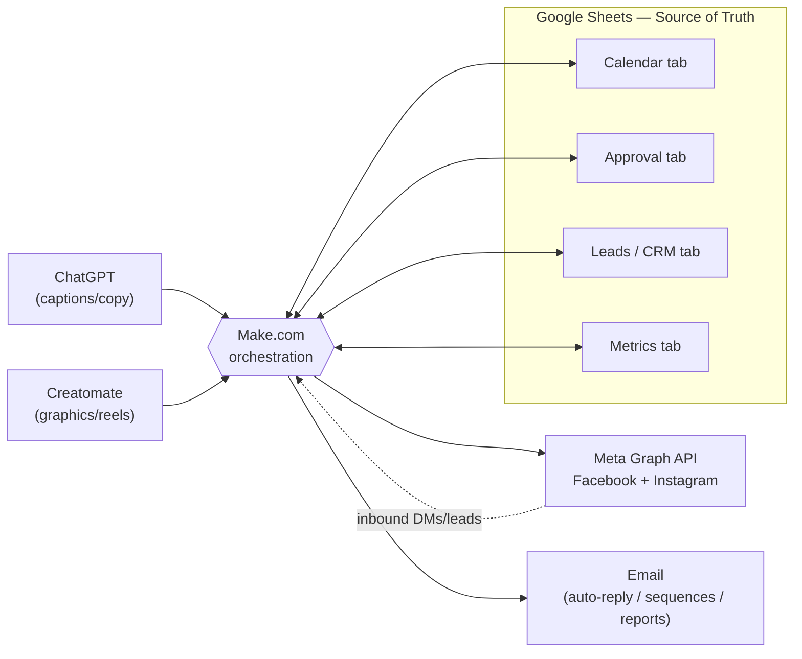
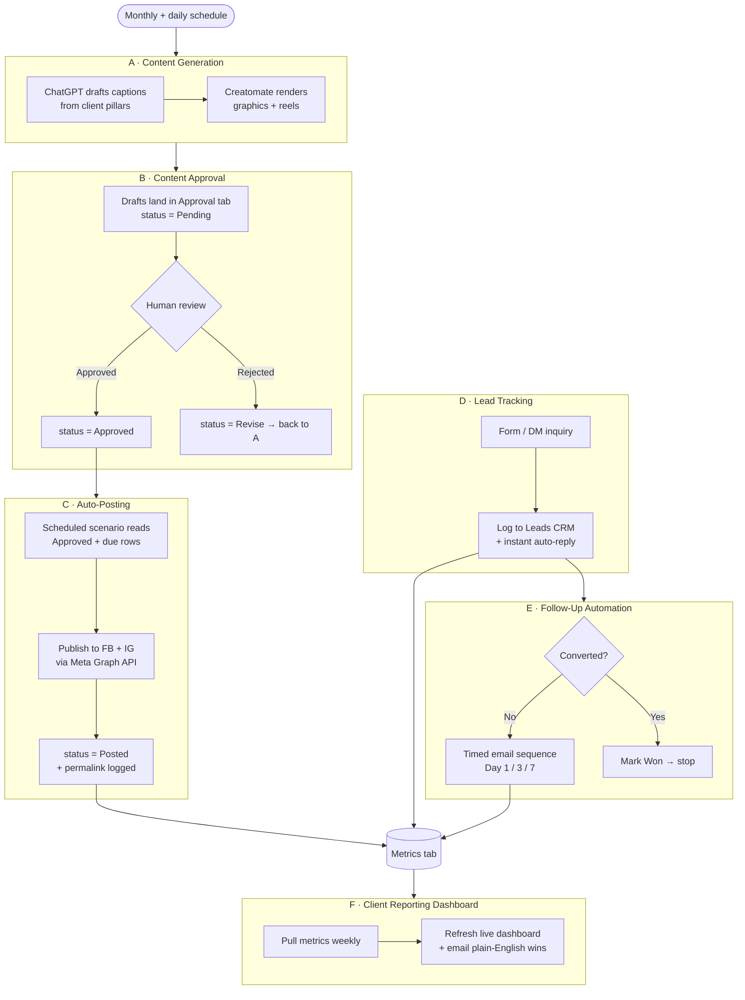
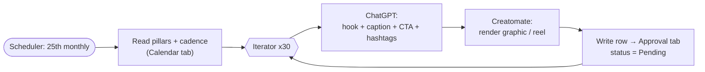
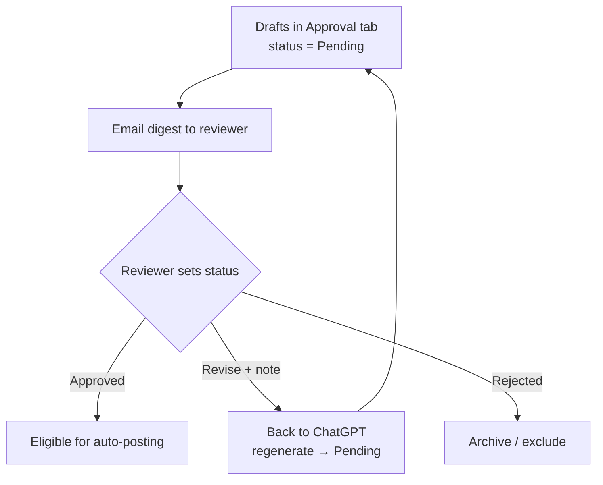
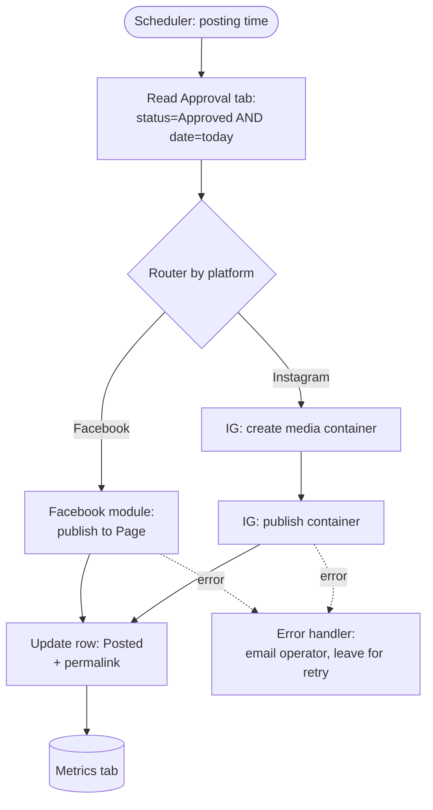
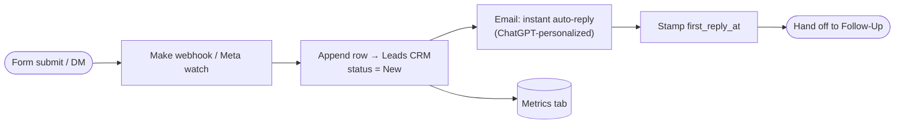
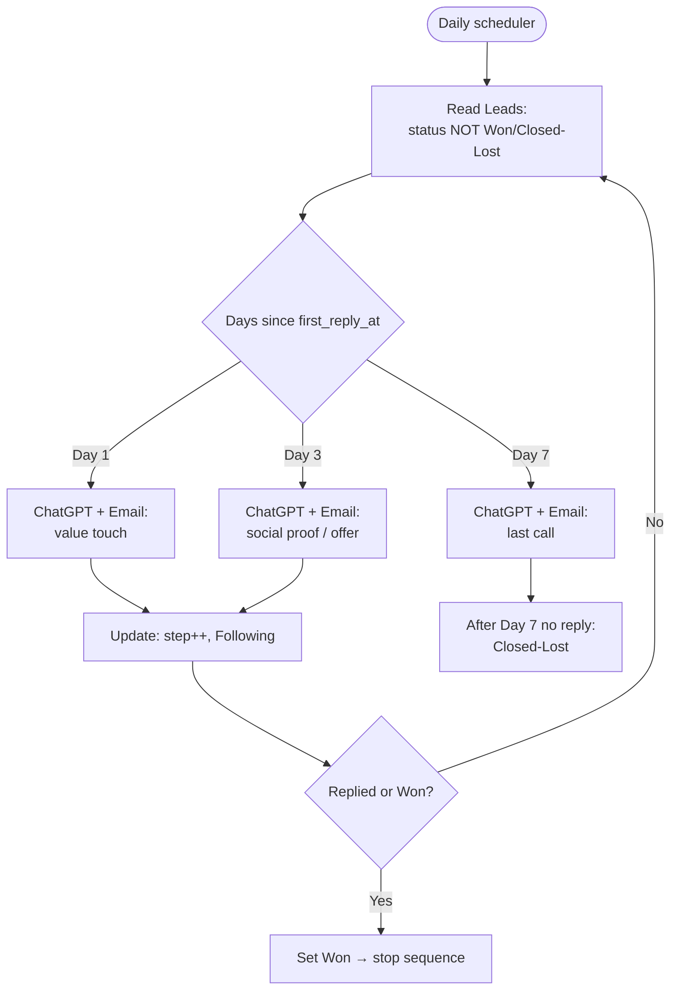
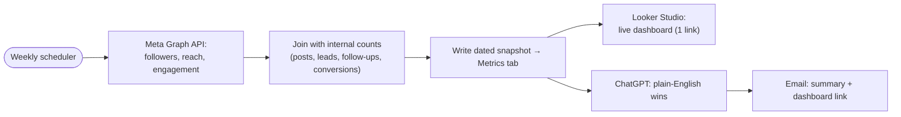

# A.I. STaRR Client Automation Engine — The Build

Internal build doc · Companion to [`README.md`](README.md) and
[`sops-and-training.md`](sops-and-training.md).
Stack per [`../_shared/brand-guide.md`](../_shared/brand-guide.md#5-standard-ai-automation-stack).

> **Purpose:** wire six Make.com workflows into one engine that takes client content
> from idea to published to reported with ~80% less manual work. This document
> specifies, for each workflow: **trigger → steps → tools → output → hours saved**, plus
> the integration stack and **mermaid automation diagrams**.

---

## Integration Stack

The engine runs on the standard a.i. STaRR stack. Every workflow is a Make.com
*scenario*; Google Sheets is the shared source of truth that ties them together.

| Tool | Role | Connects to |
|---|---|---|
| **Make.com** | Orchestration engine — hosts all six scenarios, schedules, and routers | Everything below |
| **Google Sheets** | Source of truth: Content Calendar, Approval Queue, Lead CRM, Metrics tabs | Make.com (read/write) |
| **ChatGPT (OpenAI)** | Generates captions, hooks, hashtags, follow-up copy | Make.com (OpenAI module) |
| **Creatomate** | Renders branded graphics + reels from templates via API | Make.com (HTTP/Creatomate module) |
| **Facebook Page (Meta Graph API)** | Auto-publish feed posts + media | Make.com (Facebook module) |
| **Instagram Business (Meta Graph API)** | Auto-publish feed posts, images, reels | Make.com (Instagram module) |
| **Email** | Auto-reply, follow-up sequences, approval pings, report delivery | Make.com (Email/Gmail module) |

### How the tools connect

One **client = one Google Sheet** (tabs: `Calendar`, `Approval`, `Leads`, `Metrics`)
plus one set of Make scenarios scoped to that client. Adding a client means cloning the
Sheet and duplicating the scenarios — *add a row/clone, not a hire*.

**Notes on platform behavior — verify in build:**
- Meta Graph API publishing to Instagram Business / Facebook Pages uses long-lived or
  **System User tokens** for reliable ongoing automation; short-lived tokens expire and
  break scenarios. **Verify token type + refresh in build.**
- **Reels / carousels** are not always fully publishable via third-party APIs and may
  need a workaround or a manual push. **Verify Reels publishing support in build.**
- Instagram personal (non-Business) profiles cannot be posted to via the API — the
  account must be a **Business/Creator** account linked to a Facebook Page.
  **Verify account type in build.**

---

## Master Engine Diagram

End-to-end flow across all six workflows. Each lettered block is detailed below.

---

## Workflow A — Content Generation

Turns each client's content pillars into a month of draft posts (caption + graphic/reel)
with no manual writing or designing.

| Field | Detail |
|---|---|
| **Trigger** | Make scheduler — runs ~25th of each month (build next month's batch); plus an on-demand manual run |
| **Tools** | Make.com · Google Sheets (`Calendar`) · ChatGPT (OpenAI) · Creatomate |
| **Output** | ~30 draft rows per client: date, platform, pillar, caption, hashtags, asset URL — written to the `Approval` tab as `Pending` |
| **Hours saved/wk** | **~6** (writing + design at scale) |

**Steps:**
1. **Scheduler fires** and reads the client's pillar config + posting cadence from the
   `Calendar` tab (pillars come from the client strategy — e.g. Whale Harbor's "5 S's").
2. **Iterator** loops the target post count (e.g. 30) and assigns each a date + platform
   + pillar from the cadence rule.
3. **ChatGPT module** generates, per row: a hook, caption, CTA, and hashtag set on-brand
   for that client and pillar (system prompt carries the brand voice from
   [`../_shared/brand-guide.md`](../_shared/brand-guide.md#3-voice--tone)).
4. **Creatomate module** renders the matching asset — a branded graphic for feed posts,
   a templated reel for video slots — by passing caption/title text into a client
   template, returning a hosted asset URL.
5. **Google Sheets** writes each completed row to the `Approval` tab with
   `status = Pending`.

> **Verify in build:** Creatomate reel rendering time and template field mapping; batch
> generation cost per client (ChatGPT tokens + Creatomate render credits).

---

## Workflow B — Content Approval

The human gate. Nothing reaches a client's audience without a person setting `Approved`.
This keeps the engine fast *and* safe.

| Field | Detail |
|---|---|
| **Trigger** | Two paths: (1) end of Workflow A drops drafts in; (2) a Make scenario watches the `Approval` tab for status changes |
| **Tools** | Make.com · Google Sheets (`Approval`) · Email |
| **Output** | Each row resolved to `Approved`, `Revise`, or `Rejected`; approved rows become eligible for posting |
| **Hours saved/wk** | **~2** (batch review beats one-by-one scheduling) |

**Steps:**
1. After Workflow A writes drafts, Make sends the operator/account manager an **email
   digest** with a link to the `Approval` tab and a count of `Pending` rows.
2. Reviewer reads each draft (caption + asset preview) and sets the **status column**:
   `Approved`, `Revise` (with a note), or `Rejected`.
3. A **watch scenario** reacts to status:
   - `Approved` → row becomes eligible for Workflow C (auto-posting).
   - `Revise` → row routes back to Workflow A's ChatGPT step with the reviewer note as
     extra instruction; regenerates and returns to `Pending`.
   - `Rejected` → archived, excluded from posting.

> **Verify in build:** Make's Google Sheets "watch rows" polling interval (affects how
> fast a status change is picked up).

---

## Workflow C — Auto-Posting

Publishes approved, scheduled content to Facebook and Instagram with no one at the
keyboard. This is the visible payoff: daily posting, on time, automatically.

| Field | Detail |
|---|---|
| **Trigger** | Make scheduler — runs at the client's posting times (e.g. daily 9:00am) |
| **Tools** | Make.com · Google Sheets (`Approval`) · Facebook + Instagram (Meta Graph API) |
| **Output** | Live FB + IG posts; row updated to `Posted` with timestamp + permalink, then mirrored to `Metrics` |
| **Hours saved/wk** | **~5** (manual scheduling + uploading eliminated) |

**Steps:**
1. **Scheduler fires** at posting time and reads the `Approval` tab, filtering rows where
   `status = Approved` **and** `post_date = today` (and the due time slot).
2. **Router** branches by `platform`:
   - **Facebook** → Facebook module publishes the post + media to the client Page.
   - **Instagram** → Instagram module publishes image/reel + caption to the Business
     account (two-step: create media container → publish).
3. On success, **Google Sheets** updates the row: `status = Posted`, posting timestamp,
   and returned **permalink/post ID**.
4. Make appends the post reference to the `Metrics` tab so Workflow F can later pull
   reach/engagement.
5. On error (token expired, API reject), Make routes to an **error handler** that emails
   the operator and leaves the row `Approved` for retry.

> **Verify in build:** Meta token type/refresh (System User token recommended); whether
> **Reels** publish fully via API or need a manual push; per-account daily publish limits;
> Instagram requires the two-step container/publish flow. All **verify in build.**

---

## Workflow D — Lead Tracking

Captures every inbound inquiry (form or DM), logs it to the CRM, and fires an instant
auto-reply so no lead goes cold while waiting on a human.

| Field | Detail |
|---|---|
| **Trigger** | Webhook from a lead form submission; and/or a Make watch on Facebook/Instagram lead/DM events |
| **Tools** | Make.com · Google Sheets (`Leads`) · Email · (Meta Graph API for DM-sourced leads) |
| **Output** | New row in `Leads` CRM (name, contact, source, message, timestamp, `status = New`); instant auto-reply sent |
| **Hours saved/wk** | **~4** (manual triage, copy/paste into CRM, first reply) |

**Steps:**
1. **Lead arrives** — a form submit hits a Make **webhook**, or a DM/lead event is pulled
   from Meta. **Verify in build:** DM/lead-ad ingestion availability per the client's Meta
   setup.
2. **Google Sheets** appends a row to the `Leads` tab: name, email/phone, source
   (form/IG/FB), message, timestamp, `status = New`.
3. **Email module** sends an **instant branded auto-reply** ("Thanks — we got your message,
   here's what happens next"), personalized via ChatGPT if the inquiry needs a tailored
   first touch.
4. Make stamps `first_reply_at` and sets `status = New` to hand off to Workflow E.
5. Lead reference is mirrored to `Metrics` for the dashboard's lead count.

> **Verify in build:** whether the client uses native Meta lead ads vs. a website form;
> DM automation is subject to Meta messaging policy windows — **verify in build.**

---

## Workflow E — Follow-Up Automation

Chases leads that haven't converted with a timed email sequence, then stops the moment
they reply or are marked won. Turns "I'll follow up later" into a system.

| Field | Detail |
|---|---|
| **Trigger** | Make scheduler — runs daily; evaluates `Leads` rows by age + status |
| **Tools** | Make.com · Google Sheets (`Leads`) · ChatGPT · Email |
| **Output** | Day-1 / Day-3 / Day-7 follow-up emails; status advanced to `Following`, `Won`, or `Closed-Lost` |
| **Hours saved/wk** | **~3** (manual reminders + writing follow-ups) |

**Steps:**
1. **Daily scheduler** reads the `Leads` tab and filters rows where
   `status NOT IN (Won, Closed-Lost)`.
2. For each, Make computes **days since `first_reply_at`** and selects the matching step:
   Day 1 (value touch), Day 3 (social proof / offer), Day 7 (last call).
3. **ChatGPT** drafts a context-aware follow-up from the original inquiry + the step's
   intent; **Email** sends it.
4. Make updates the row: increments `followup_step`, sets `status = Following`, stamps
   `last_touch_at`.
5. **Stop conditions:** if the lead replies (or a human sets `Won`), Make sets `Won` and
   halts the sequence; after Day 7 with no response, sets `Closed-Lost`.

> **Verify in build:** reply detection (inbox watch vs. manual `Won` flag); email sending
> limits/deliverability on the client domain — **verify in build.**

---

## Workflow F — Client Reporting Dashboard

Rolls every engine output into one live, shareable dashboard plus a plain-English weekly
email — so the client sees wins without anyone building a report by hand.

| Field | Detail |
|---|---|
| **Trigger** | Make scheduler — weekly (e.g. Monday 8:00am); plus continuous metric appends from C/D/E |
| **Tools** | Make.com · Google Sheets (`Metrics`) · Meta Graph API (insights) · Email · *(Looker Studio for the visual layer)* |
| **Output** | Refreshed live dashboard (followers, reach, top posts, posts published, leads, follow-ups, conversions); weekly summary email |
| **Hours saved/wk** | **~4** (pulling metrics + assembling reports) |

**Steps:**
1. **Weekly scheduler** triggers a metrics pull. Make calls the **Meta Graph API insights**
   endpoints for followers, reach, impressions, and per-post engagement on the week's
   `Posted` rows.
2. Make joins those numbers with internal counts from `Metrics` (posts published, leads
   captured, follow-ups sent, conversions) and writes a dated snapshot to the `Metrics`
   tab.
3. **Looker Studio** (connected to the `Metrics` sheet) renders the **live dashboard** —
   one shareable link, always current. **Verify in build:** Looker Studio connection +
   refresh cadence.
4. **ChatGPT** turns the week's numbers into a short **plain-English "here's what's
   working"** summary (no jargon — per brand voice).
5. **Email** sends the summary + dashboard link to the client (and to the internal
   account manager).

> **Verify in build:** Meta insights metric availability per account; Looker Studio vs. a
> native Sheets dashboard if Looker is not used — **verify in build.**

---

## Hours-Saved Summary

| Workflow | Hours saved/wk |
|---|---|
| A — Content Generation | ~6 |
| B — Content Approval | ~2 |
| C — Auto-Posting | ~5 |
| D — Lead Tracking | ~4 |
| E — Follow-Up Automation | ~3 |
| F — Client Reporting Dashboard | ~4 |
| **Total** | **~24 hrs/wk** |

This clears the **10+ hours/week** mandate with margin, and represents roughly **80%** of
the recurring manual marketing workload removed. The per-workflow breakdown and the proof
math are detailed in
[`sops-and-training.md` → Hours-Saved Summary](sops-and-training.md#hours-saved-per-week-summary).

---

## Sources / Research

Capabilities below informed this build; items the engine depends on that vary by platform
are flagged **verify in build** above.

- [Make — Create automated posts with Make's AI](https://www.make.com/en/how-to-guides/turn-product-updates-into-social-media-with-make-ai) — AI-decide → generate copy/image → auto-publish to chosen platform.
- [Make — Social Media AI Automation](https://www.make.com/en/automate/social-media-management) and [Facebook Integration](https://www.make.com/en/integrations/facebook) — native FB/IG publishing modules.
- [Cloud Cache Consulting — Automate Social Media Posts Using Make.com](https://cloudcacheconsulting.com/blog/how-to-automate-social-media-posts-using-makecom) — Google Sheets / Notion-driven auto-posting scenarios.
- [Monolit — Make.com Social Media Automation Workflows (2026)](https://monolit.sh/blog/make-com-social-media-automation-workflows-for-founders-2026) — 5–10 hrs/wk saved; notes API posting limits and Reels/carousel workarounds.
- [n8n — Automate Instagram & Facebook posting with Meta Graph API & System User Tokens](https://n8n.io/workflows/5457-automate-instagram-and-facebook-posting-with-meta-graph-api-and-system-user-tokens/) — System User token approach for reliable ongoing publishing.
- [Make Community — Scheduled auto-posts on Facebook via ChatGPT](https://community.make.com/t/setting-up-scheduled-auto-posts-on-facebook-via-chatgpt/15716) — Sheet-controlled, ChatGPT-powered posting pattern.
- [APITemplate.io — Automate Instagram content with Make.com](https://apitemplate.io/blog/integromat-save-time-and-boost-engagement-by-scheduling-and-automating-social-content-generation/) — auto-generate images + schedule to IG/FB.
- [Creatomate — Create AI-Generated Videos using ChatGPT and Make.com](https://creatomate.com/blog/how-to-create-ai-generated-videos-using-chatgpt-and-make) and [Automate Video Creation with Make.com](https://creatomate.com/blog/how-to-automate-video-creation-with-make) — ChatGPT → Creatomate template render → publish pipeline.
